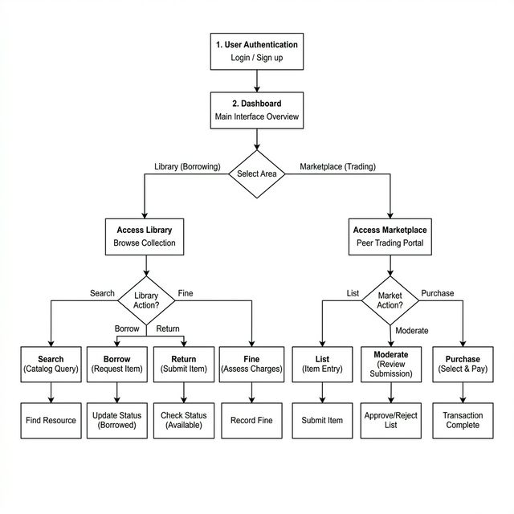
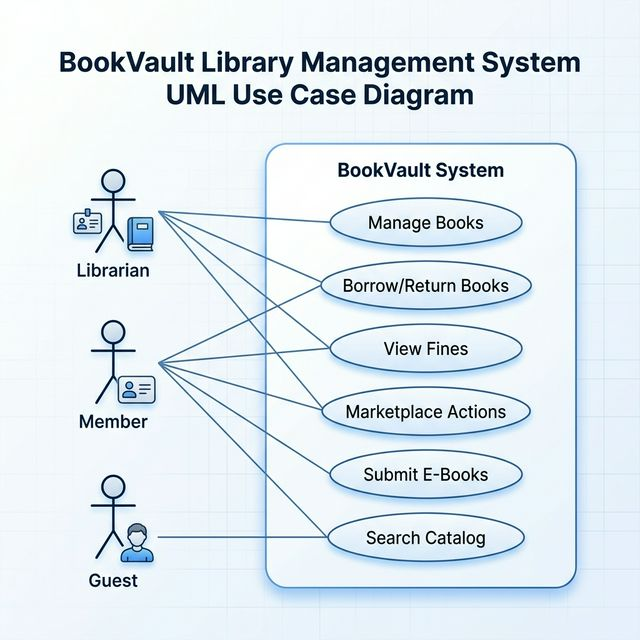
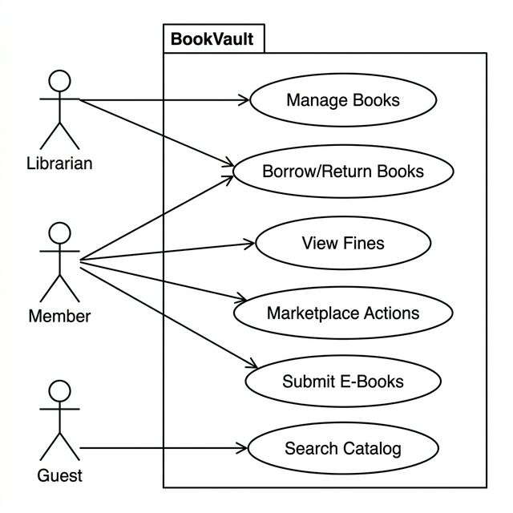
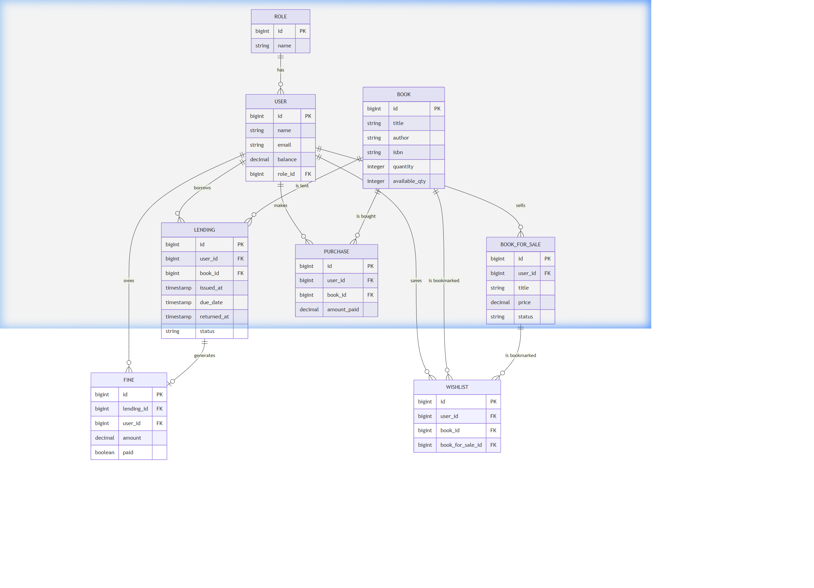

# BookVault: Integrated Library and Peer-to-Peer Marketplace System

## RAJAGIRI COLLEGE OF SOCIAL SCIENCES
**(AUTONOMOUS) KALAMASSERY**
Department of Computer Science
Web Programming Project Report
*Done by [Your Name]*
*Reg No: [Your Register Number]*
*Under the guidance of [Your Guide's Name]*
*2024-2028*

---

## CERTIFICATE
**BookVault: Integrated Library and Peer-to-Peer Marketplace System**
Certified that this is the bonafide record of project work done by **[Your Name]** Reg No: **[Your Register Number]**
During the academic year 2024-2028, in partial fulfillment of requirements for award of the degree, Bachelor in Computer Science
Rajagiri College of Social Sciences (Autonomous)

*Faculty Guide* | *Head of the Department*
Prof. Bindiya M Varghese
*Project Coordinator* | *External Examiner*

---

## ACKNOWLEDGEMENT
With heartfelt gratitude, I extend my deepest thanks to the Almighty for His unwavering grace and blessings that have made this journey possible. May His guidance continue to illuminate my path in the years ahead.

I am immensely thankful to Dr. Bindiya M Varghese, Dean, Department of Computer Science and [Your Guide's Name], Faculty Guide, for their invaluable guidance and timely advice, which played a pivotal role in shaping this project. Their guidance, constant supervision, and provision of essential information were instrumental in the successful completion of the Project.

I extend my profound thanks to all the professors in the department and the entire staff at RCSS for their unwavering support and inspiration throughout my academic journey. My sincere appreciation goes to my beloved parents, whose guidance has been a beacon in every step of my path.

I am also grateful to my friends and individuals who generously shared their expertise and assistance, contributing significantly to the fulfillment of this endeavor.

*[Your Name]*

---

## ABSTRACT
**BookVault** is a comprehensive, multi-faceted platform developed using the latest Laravel framework, React, and Inertia.js, designed to revolutionize how readers and institutions interact with literary resources. The primary objective of the system is to bridge the gap between traditional library administration and modern peer-to-peer e-commerce within a single, unified ecosystem.

The system features robust authentication, personalized member dashboards, and modular interfaces guided by Role-Based Access Control (RBAC). For library management, it provides an extensive lending service where users can explore a rich catalog of physical books, track borrowing history, and securely resolve accumulated fines. For community engagement, it features a robust peer-to-peer marketplace that empowers members to list personal books for sale and participate safely in community-driven transactions. 

Furthermore, the platform incorporates digital accessibility through a dedicated e-book submission and purchasing system, allowing members to upload and monetize digital content pending Librarian moderation. By combining an elegant Tailwind CSS-driven user interface with powerful back-end features, BookVault ensures efficient inventory management, transparent pricing, and improved customer satisfaction in the literary domain.

---

## CONTENTS
1. INTRODUCTION
2. SUPPORTING LITERATURE
   - Overview
   - Review of Technologies
   - Proposed Enhancements
3. SYSTEM ANALYSIS
   - Module Description
   - Business Rules
   - Feasibility Analysis
   - System Environment
4. SYSTEM DESIGN
   - Architecture Overview
   - Database Design
   - User Interface Design
   - Workflow Diagram
   - Entity-Relationship (ER) Diagram
5. TESTING
   - Unit Testing
   - Integration Testing
   - User Acceptance and UI Testing
6. DEPLOYMENT
   - Local Deployment
   - Production Deployment
7. GIT HISTORY
   - Commit Practices
   - Branching Strategy
8. CONCLUSION
9. APPENDIX
   - Tools and Libraries Used

---

## 1. INTRODUCTION
The advent of the internet has significantly revolutionized typical operations, opening the pathway for centralized online services. Library management and peer-to-peer book sales have traditionally existed as disconnected ecosystems, requiring users to juggle multiple platforms, physical visits, and manual paperwork to fully satisfy their literary needs.

The "BookVault" project aims to modernize this workflow through a full-stack, comprehensive web application built with the robust PHP framework, Laravel, integrated tightly with React and Inertia.js. It provides a cohesive online platform tailored to solve the inconveniences of conventional library catalogs and disjointed marketplace forums by bringing administrators, librarians, and members onto a singular stage.

Through BookVault, customers can effortlessly browse inventory, reserve library texts, and track fine accumulations dynamically. This eliminates the friction associated with verifying book availability in person. Moreover, the project introduces a peer-to-peer marketplace, allowing users to monetize their own physical or digital copies under the safe moderation of the platform's administrators.

Ultimately, BookVault simplifies inventory tracking for librarians while offering an interactive, reliable, and secure e-commerce and lending user experience.

---

## 2. SUPPORTING LITERATURE

### Overview
The study of existing systems highlights several operational gaps in traditional library and book marketplace workflows. Many current solutions manage lending via isolated spreadsheets lacking a modern customer-centric portal, or they operate monolithic e-commerce platforms that do not facilitate physical library lending alongside peer-to-peer sales.

### Review of Technologies
- **Laravel Framework:** Known for its elegant syntax and MVC architecture, Laravel serves as an excellent backend choice for dynamic web applications. Its Eloquent ORM enables robust and secure database manipulation.
- **Inertia.js & React:** Inertia bridges the gap between Laravel’s backend routing and modern frontend frameworks like React, allowing the creation of a seamless Single Page Application (SPA) experience without building a separate API.
- **Tailwind CSS:** A utility-first CSS framework that allows rapid UI creation directly within JSX components. It ensures the application is fully responsive and visually modern out-of-the-box.

### Proposed Enhancements
While basic library management systems handle simple checkout operations, BookVault includes modern unified enhancements such as a dynamic Wishlist module catering to both marketplace items and library books, and a streamlined digital submission pipeline, elevating the software beyond mere CRUD functionality.

---

## 3. SYSTEM ANALYSIS

### Module Description
The "BookVault" project is divided into distinct functional modules catering to specific platform needs:

1. **Authentication & Role Management:** Handles secure login and registration. Security and feature gating are securely handled by a robust Role-Based Access Control architecture (Members, Librarians) protecting sensitive administrative routes.
2. **Book & Inventory Management:** Librarians can add new physical books, update metadata, and adjust stock. Members can submit digital e-books which land in a pending state for moderation.
3. **Lending & Fine Management:** Governs the lifecycle of borrowing physical books, deducting available stock, calculating due dates, and dynamically generating monetary penalties for overdue returns.
4. **Marketplace Module:** A peer-to-peer e-commerce layer where members list personal used books. Listings require Librarian approval before entering the public catalog.
5. **Wishlist Module:** A unified bookmarking system allowing users to save both library books and marketplace items for future reference or immediate action via their personalized dashboard.

### Business Rules
1. **Access Boundaries:** Core platform features require user authentication. Administrative actions (inventory updates, moderation) are restricted to the `Librarian` role.
2. **Lending Constraints:** Loans are processed only if `available_qty` > 0. Stock depletes immediately on checkout and restores on return.
3. **Moderation Pipeline:** Any user-submitted content (e-books, marketplace listings) defaults to a `pending` status and cannot be viewed publicly until explicitly approved by a Librarian.
4. **Fine Protocols:** Overdue returns dynamically accumulate monetary penalties, which users must resolve through the platform's payment portal.
5. **Wishlist Logic:** Users can save library or marketplace assets to a wishlist, but cannot add the exact same database entity more than once.

### Feasibility Analysis
- **Technical Feasibility:** Laravel coupled with React/Inertia is highly capable of handling the dual-sided nature of the application. The architecture is widely adopted and supported across all modern browsers.
- **Economical Feasibility:** Built entirely on open-source infrastructure (PHP, React, standard SQL databases), eliminating dependency on expensive proprietary licensing.
- **Operational Feasibility:** By automating stock adjustments, fine calculations, and moderation queues, BookVault drastically reduces the manual overhead required to maintain a digital library and marketplace.

### System Environment
- **Software Environment:** 
  - Framework: Laravel 11.x
  - Frontend: React, Inertia.js, Tailwind CSS
  - Database Engine: MySQL / PostgreSQL / SQLite
  - Languages: PHP 8.2+, JavaScript (JSX)
  - Version Control: Git / GitHub
- **Hardware Environment:**
  - Processor: Modern Multi-core CPU
  - Memory: Minimum 8 GB RAM
  - Storage: SSD preferred
  - OS: Windows / Linux / macOS

---

## 4. SYSTEM DESIGN

### Architecture Overview
The project refines the standard MVC architectural pattern by integrating Inertia.js:
- **Model:** Eloquent classes mapping to database tables (User, Book, Lending, BookForSale, Fine, Wishlist).
- **View:** React components structuring the UI securely delivered via Inertia.
- **Controller:** PHP scripts handling HTTP requests, interacting with Models, and passing props directly to the React layer.

### Database Design
The architecture utilizes foreign keys for strict referential integrity with cascading updates and deletions to prevent orphaned data.
- **Users Table:** Stores authentication details, role affiliations, and wallet balance.
- **Books Table:** Contains library catalog items (ISBN, title, author, available quantity).
- **Book_For_Sales Table:** Peer-to-peer listings carrying seller IDs, price, and moderation status.
- **Lendings & Fines Tables:** Links users to library books with explicit issuance, return timestamps, and penalty accruals.
- **Wishlists Table:** A polymorphic-friendly schema tracking saved books and marketplace items per user.

### Database Tables Summary
The BookVault system is built upon a relational database schema comprising 8 core tables, each serving a specific role in the library and marketplace ecosystem.

| Table Name | Purpose / Description |
| :--- | :--- |
| **roles** | Manages user authorization levels (e.g., Librarian, Member). |
| **users** | Stores user account information and virtual wallet balances. |
| **books** | Central catalog for library-owned physical and digital books. |
| **lendings** | Tracks the borrowing lifecycle of physical library assets. |
| **fines** | Manages monetary penalties for late book returns. |
| **book_for_sales** | Facilitates the peer-to-peer marketplace listings. |
| **purchases** | Records financial transactions for marketplace items. |
| **wishlists** | Allows users to bookmark library or marketplace items. |

### Data Dictionary
### Data Dictionary
#### Table 3.1: Users Table (users)
| Column Name | Data Type | Description |
| :--- | :--- | :--- |
| id | BigInt, AI | Primary Key |
| name | Varchar(255) | User's full name |
| email | Varchar(255) | Unique email address |
| balance | Decimal(10,2) | User's wallet balance (Default 0.00) |
| password | Varchar(255) | Hashed password |
| role_id | BigInt | Foreign Key (Roles) |
| created_at | Timestamp | Record creation time |
| updated_at | Timestamp | Record modification time |

#### Table 3.2: Books Table (books)
| Column Name | Data Type | Description |
| :--- | :--- | :--- |
| id | BigInt, AI | Primary Key |
| title | Varchar(255) | Title of the book |
| author | Varchar(255) | Author of the book |
| isbn | Varchar(255) | Unique ISBN |
| published_year | Integer | Year of publication |
| quantity | Integer | Total stock (Lendable) |
| available_qty | Integer | Current available stock |
| description | Text | Book overview |
| cover_image | Varchar(255) | Path to cover image |
| created_at | Timestamp | Record creation time |
| updated_at | Timestamp | Record modification time |

#### Table 3.3: Lendings Table (lendings)
| Column Name | Data Type | Description |
| :--- | :--- | :--- |
| id | BigInt, AI | Primary Key |
| user_id | BigInt | Foreign Key (Users) |
| book_id | BigInt | Foreign Key (Books) |
| issued_at | Timestamp | Time of issuance (Default Current) |
| due_date | Timestamp | Deadline for return |
| returned_at | Timestamp | Actual return time |
| status | Varchar(255) | Borrowing status (e.g., 'borrowed') |
| created_at | Timestamp | Record creation time |
| updated_at | Timestamp | Record modification time |

#### Table 3.4: Fines Table (fines)
| Column Name | Data Type | Description |
| :--- | :--- | :--- |
| id | BigInt, AI | Primary Key |
| lending_id | BigInt | Foreign Key (Lendings) |
| user_id | BigInt | Foreign Key (Users) |
| amount | Decimal(8,2) | Penalty amount |
| paid | Boolean | Status of payment (Default false) |
| created_at | Timestamp | Record creation time |
| updated_at | Timestamp | Record modification time |

#### Table 3.5: BookForSales Table (book_for_sales)
| Column Name | Data Type | Description |
| :--- | :--- | :--- |
| id | BigInt, AI | Primary Key |
| user_id | BigInt | Foreign Key (Seller) |
| title | Varchar(255) | Book title for sale |
| author | Varchar(255) | Book author |
| price | Decimal(8,2) | Selling price |
| description | Text | Item description |
| condition | Varchar(255) | Item condition (e.g., 'New') |
| status | Varchar(255) | Moderation status (Default 'pending') |
| created_at | Timestamp | Record creation time |
| updated_at | Timestamp | Record modification time |

#### Table 3.6: Wishlists Table (wishlists)
| Column Name | Data Type | Description |
| :--- | :--- | :--- |
| id | BigInt, AI | Primary Key |
| user_id | BigInt | Foreign Key (Users) |
| book_id | BigInt | Foreign Key (Books), Nullable |
| book_for_sale_id | BigInt | Foreign Key (Marketplace), Nullable |
| created_at | Timestamp | Record creation time |
| updated_at | Timestamp | Record modification time |

#### Table 3.7: Roles Table (roles)
| Column Name | Data Type | Description |
| :--- | :--- | :--- |
| id | BigInt, AI | Primary Key |
| name | Varchar(255) | Role name (e.g., 'Member') |
| created_at | Timestamp | Record creation time |
| updated_at | Timestamp | Record modification time |

#### Table 3.8: Purchases Table (purchases)
| Column Name | Data Type | Description |
| :--- | :--- | :--- |
| id | BigInt, AI | Primary Key |
| user_id | BigInt | Foreign Key (Buyer) |
| book_id | BigInt | Foreign Key (Book) |
| amount_paid | Decimal(8,2) | Total paid amount |
| commission_earned | Decimal(8,2) | Platform fee earned |
| created_at | Timestamp | Record creation time |
| updated_at | Timestamp | Record modification time |

### Workflow Diagram
The following diagram illustrates the integrated workflow across different user roles within the BookVault system.

### Use Case Diagram
The following diagrams illustrate the interaction between different actors and the BookVault system.

### Entity-Relationship (ER) Diagram
The following diagram showcases the database schema and the relationships between various entities in the BookVault system.

### User Interface Design
An emphasis is placed on creating an immersive and responsive interface using Tailwind CSS and React components, featuring dynamic dashboards, modular generic components (PrimaryButton), and soft container styles.
*(Diagrams/Screenshots placeholder: Insert screenshots of Landing Page, Dashboard, and Marketplace here)*

---

## 5. TESTING

### Unit Testing
Unit tests verify individual components in isolation.
- **Model Testing:** Validated Book, User, and Lending Eloquent models to ensure relationships (e.g., `$user->lendings()`) and mass-assignment rules function correctly.
- **Controller/Route Testing:** Validated accessibility, ensuring standard members are bounced via 403 Forbidden redirects when attempting to access `role:Librarian` middleware routes.

### Integration Testing
- **Database Integration:** Assessed if creating a Lending record properly checks the available stock and correctly fires the decrement query, and conversely upon return.
- **Moderation Workflow Testing:** Verified that `pending` items correctly exclude themselves from public query scopes until a Librarian updates their status.

### User Acceptance and UI Testing
Tested across multiple viewports (Mobile, Tablet, Desktop) to ensure the Tailwind CSS structure dynamically scales. Manual end-to-end simulated flows included: logging in, adding an item to the wishlist, checking out a library book, simulating a delayed return, and successfully executing a fine payment.

---

## 6. DEPLOYMENT

### Local Deployment
During development, Laravel provides a localized environment.
1. Clone the repository and configure `.env` with correct database credentials.
2. Run `composer install` and `npm install`.
3. Generate schemas using `php artisan migrate`.
4. Run `npm run dev` to compile React assets utilizing Vite, and `php artisan serve` for the backend.

### Production Deployment
For deployment, standard VPS or Managed Hosting solutions (like Laravel Forge) support the PHP/Node.js requirements. An SSL certificate is critical to protect authenticated sessions and secure marketplace transactions.

---

## 7. GIT HISTORY

### Commit Practices
Semantic commit messages were utilized to ensure an organized timeline. Commits were focused on specific features (e.g., adding wishlist migrations, removing admin role definitions) rather than undocumented monolithic updates.

### Branching Strategy
Development utilized iterative commits to the main repository, isolating experimental features to ensure the core routing and authentication architectures remained stable throughout the development lifecycle.

---

## 8. CONCLUSION
The BookVault platform successfully merges the traditional bounds of library cataloging with modern peer-to-peer e-commerce. Employing the robust backend architecture of Laravel alongside the modern, reactive frontend capabilities of Inertia and React ensures code maintainability, speed, and scalability. 

Customer friction is drastically minimized via unified dashboards where users can govern loans, track fine payments, and manage marketplace listings concurrently. Driven by automated stock enforcement and a strict moderation pipeline, BookVault is an engaging, comprehensive web application that provides substantial organizational value to modern library administrators.

---

## 9. APPENDIX

### Tools and Libraries Used
- **Laravel 11.x:** The primary PHP framework for backend routing and database interactions.
- **React & Inertia.js:** Used to construct a dynamic, single-page application experience.
- **Tailwind CSS:** Utility-first library for rapid application styling.
- **MySQL/SQLite:** Relational database systems for maintaining user records, lending histories, and marketplace data.
